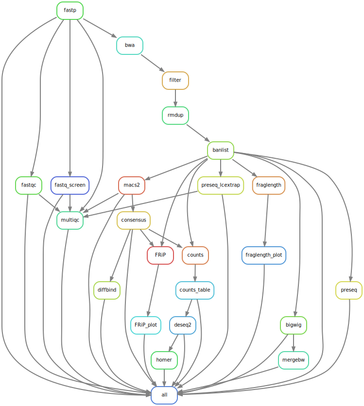

# atac_seq

[](https://svgshare.com/i/Zhy.svg)

[](https://shields.io/)


Process and analyze your PE ATAC-Seq datasets

## 1. Prepare your work environment

```bash
# clone this repo to a new working directory
git clone git@github.com:maxsonBraunLab/atac_seq2.git

# cd into atac_seq-2.0 and make new dir for your FASTQ files
mkdir -p samples/raw

# cd into 'samples/raw' and symlink your FASTQ files
ln -s /absolute/path/to/files/condition1_R1.fastq.gz .
ln -s /absolute/path/to/files/condition1_R2.fastq.gz .

# rename symlinks to match {condition}_{replicate}_{read}.fastq.gz
mv condition1_R2 condition_1_R1.fastq.gz
mv condition1_R2 condition_1_R2.fastq.gz

```

Double check the symlinks match the required input format: `{condition}_{replicate}_{dir}.fastq.gz`.

## 2. Prepare your conda environment

Continue forward if you don't have a conda environment with snakemake installed

```bash
# while using base conda env, create your snakemake environment
conda install -c conda-forge mamba # installs into base env
mamba create -c conda-forge -c bioconda -n snakemake snakemake # installs snakemake into new env

conda activate snakemake
```

Make sure to also install plotly in the snakemake environment with `conda install -c plotly plotly` 

## 3. Prepare your pipeline configuration

Edit the `config.yaml` file to specify which organism to use and other pipeline parameters.

Edit the `data/config/deseq2_config.tsv` file to specify which replicates belong with which condition in DESeq2.

## 4. Run the pipeline

To configure SLURM integration with OHSU's cluster, copy the entire `slurm` folder into your home directory `~/.config/snakemake` and then delete the local copy.

You can run the pipeline using an interactive node like this:

```bash
srun --cores=20 --mem=64G --time=24:00:00 --pty bash
conda activate snakemake
snakemake -j 20 --use-conda
```

This is sufficient for small jobs or running small parts of the pipeline, but not appropriate for the entire process.

To run the pipeline using batch mode use the following command:

```bash
snakemake -j 64 --use-conda --rerun-incomplete --latency-wait 60 --cluster-config cluster.yaml --profile slurm --restart-times 2

```

This will submit up to 64 jobs to exacloud servers and is appropriate for running computationally-intensive programs (read aligning, peak calling, finding consensus peaks, calculating differentially open chromatin regions).

## Pipeline Summary

### Assumptions

* When making the BWA index, chromosome names must be prefixed with 'chr' like 'chr1', 'chr2', 'chrX', and 'chrM'.

### Inputs

* Reads in this specific format: **{condition}\_{replicate}\_{dir}.fastq.gz**
    * `Condition` = experimental treatment such as: 'MOLM24D', 'SETBP1_CSF3R_Mutant' , 'SETBP1_CSF3R_Control_8hr'. Multiple underscores, text / number mixing is OK. 
    * `Replicate` = biological replicate. acceptable values are integers >= 1.
    * `Dir` = read direction. Acceptable values are ['R1', 'R2'].
    * Reads must be placed in the `data/raw` directory.
* Properly configured `config.yaml` file

### Outputs

All of the following are in the `data` directory.

* MultiQC report `data/multiqc_data/multiqc_report.html` that summarizes the following results:
    * sequencing quality from fastqc
    * sequencing quality and read trimming from fastp
    * alignment quality from bowtie2
    * library contamination from fastq_screen
    * library complexity from preseq

* FRiP and fragment length distribution `data/frip.html` `data/fraglen.html`. FRiP is more like Fraction of Reads in Consensus Peaks.

* Consensus peaks among _n_ replicates per condition where _n_ is configurable. A peak is considered a consensus peak when it is in >= _n_ number of samples per condition. 

    * For example, peak1 appears in 2 out of 3 replicates in condition1. If n = 2, then peak1 is considered a consensus peak, even if it does not appear in other conditions. 
    * For example, peak2 appears in 1 out of 3 replicates in all conditions. If n = 2, then peak2 is not a consensus peak. 

* Raw counts table of peaks (rows = intervals, cols = samples) `counts/counts_table.txt`

* Bigwig files using CPM normalization `data/bigwig`

* Differentially open chromatin regions for all unique combinations of conditions. Instead of specifying contrasts explicitly, the pipeline will assess all unique combinations of conditions.

    * PCA plot of all samples `data/deseq2/sample_PCA.png`
    * DESeq2-normalized and ln(DESeq2-normalized) counts `deseq2/norm_counts.txt`, `deseq2/log_norm_counts.txt`
    * Significant peaks split by up and down-regulation `deseq2/{contrast}/{contrast}-[up_sig|down_sig].bed`
    * Heatmap of top 50 most differential regions `deseq2/{contrast}/{contrast}-heatmap.pdf` 

* HOMER analysis of up and down differential peaks per contrast `data/homer/{contrast}-{up|down}`

    * HOMER will only run if there is >= 10 differential up/down peaks

## Methods

.


